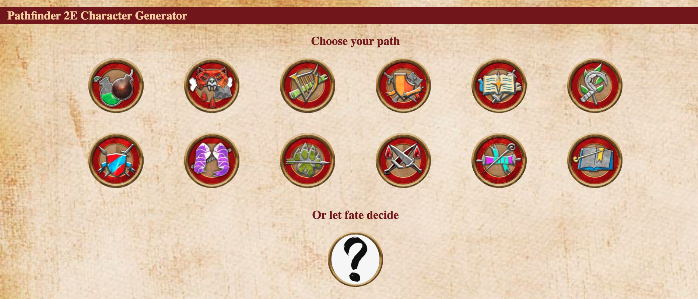
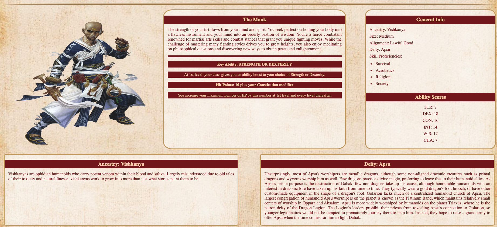

# Project Overview

## Pathfinder-2E-Random-Character-Generator

## Project Description 

Creating a new character for a tabletop RPG can be a long and difficult process. This project is designed to help speed up the process by generating a randomized character for the Pathfinder 2nd Edition Role Playing Game.

The tool is very easy to use. The user can either select one of the 12 class options, or select random, and a new character will be generated.
    -Ancestry
    -Class & Class Description
    -Ability Scores
    -Skill Proficiencies
    -Deity & Alignment

With thousands of combinations, this tool is meant to provide interesting options to inspire your next character.

### Wireframe Links

[Initial wireframe](https://www.figma.com/file/K56yvgOfxZw3KmiQUrrJSf/Pathfinder-Character-Generator?node-id=0%3A1&t=lb8D2xR9dq1vG2SX-1)

### Images of App

